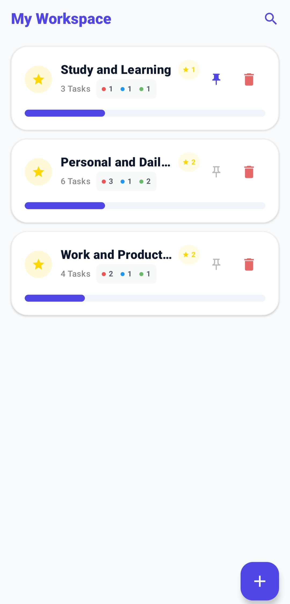
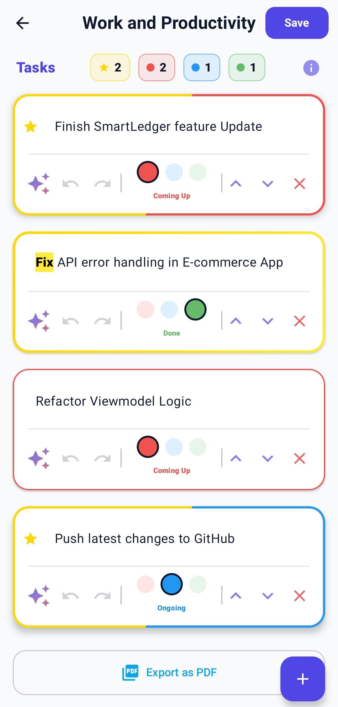
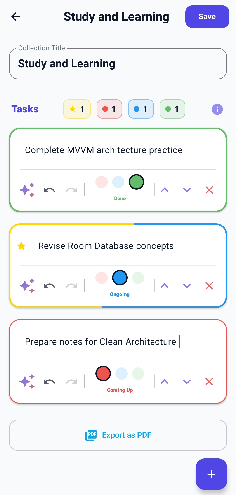
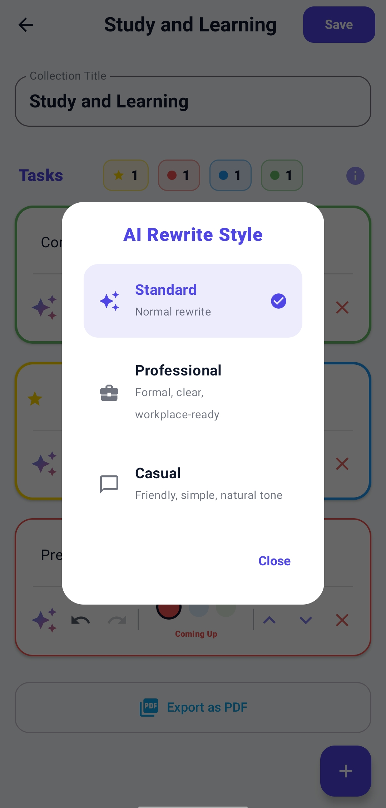

# TodoApp

## 📝 Description
TodoApp is a modern, feature-rich task management application designed to boost productivity. It goes beyond simple task lists by seamlessly integrating AI to refine and rewrite your tasks, ensuring your project planning is as clear and professional as possible.

## ✨ Features
* **AI-Powered Task Rewriting:** Utilizes the Groq API (running the `llama-3.3-70b-versatile` model) to instantly rewrite task descriptions. Users can choose between Standard, Professional, and Casual styles to match the context of their work.
* **Dynamic Search with Highlights:** Instantly filter collections and tasks from the dashboard. The application dynamically highlights matching search queries directly within the text for rapid navigation and context discovery.
* **Organized Collections:** Group tasks into overarching projects or collections. Pin high-priority collections to the top of your workspace for immediate access.
* **Visual Progress Tracking:** Get a quick overview of your productivity with multi-color progress bars that dynamically reflect the ratio of completed tasks, including specialized indicators for "Favorited" tasks.
* **Robust Undo/Redo System:** Fearlessly edit tasks with a comprehensive, built-in undo and redo stack, ensuring accidental deletions or changes are easily reverted.
* **PDF Export:** Easily export entire task collections into beautifully formatted PDF documents for sharing or offline tracking.
* **Interactive UI/UX:** Built entirely with Jetpack Compose, featuring smooth swipe-to-dismiss actions, haptic feedback, spring-physics animations, and an intuitive, modern aesthetic.

## 🛠 Tech Stack
* **Language:** Kotlin
* **UI Toolkit:** Jetpack Compose
* **Architecture:** MVVM (Model-View-ViewModel)
* **Local Database:** Room Database
* **Networking:** Retrofit (for Groq API integration)
* **Concurrency:** Kotlin Coroutines & Flow
* **Serialization:** Gson

## 🏛 Architecture
This project follows the **MVVM (Model-View-ViewModel)** architectural pattern to ensure a clean separation of concerns and a highly testable, maintainable codebase:
* **Model:** Room Database acts as the single source of truth for local data (`TodoGroupEntity`).
* **ViewModel:** `TodoViewModel` manages the UI state, handles business logic (like the custom Undo/Redo stack), and acts as the bridge between the UI and the Room database using Kotlin Flows.
* **View:** Jetpack Compose screens (`DashboardScreen`, `AddTodoScreen`) observe the ViewModel's state flows and reactively render the UI.
* **Network Layer:** A lightweight, decoupled `AiHelper` object leverages Retrofit to handle asynchronous API calls to the Groq API, offloading heavy processing from the UI thread.

## 📸 Screenshots

| Workspace Dashboard | Task Editing & Highlights |
| :---: | :---: |
|  |  |
| *View collections, pin favorites, and track progress.* | *Search text dynamically highlights inside tasks.* |

| Task Screen | AI Rewrite Styling |
| :---: | :---: |
|  |  |
| *Manage tasks with undo/redo, status tracking, and AI.* | *Choose professional or casual AI rewrite styles.* |

## 🚀 Installation

1. **Clone the repository:**
   ```bash
   git clone https://github.com/mudasirunar/TodoApp.git
   ```
2. **Open in Android Studio:**
   * Open Android Studio.
   * Select **File > Open** and navigate to the cloned `TodoApp` directory.
3. **Configure API Keys:**
   * This app requires a Groq API key for the AI rewrite features.
   * Open the `local.properties` file in the root of your project (create it if it doesn't exist).
   * Add your API key:
     ```properties
     GROQ_API_KEY="your_actual_api_key_here"
     ```
4. **Run the app:**
   * Connect an Android device or start an emulator.
   * Click the **Run** button (green play icon) in Android Studio.

## 🔮 Future Improvements
* **Cloud Sync & Authentication:** Implement Firebase Authentication and Firestore to allow users to sync their tasks across multiple devices.
* **Collaborative Workspaces:** Add features to share specific task collections with other users for real-time collaboration.
* **Voice-to-Text Entry:** Integrate voice recognition to allow users to quickly add tasks hands-free.
* **Advanced AI Features:** Expand the AI capabilities to auto-generate subtasks based on a broad project title.
