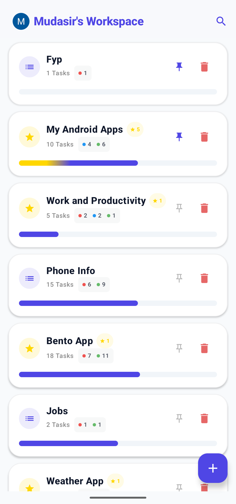
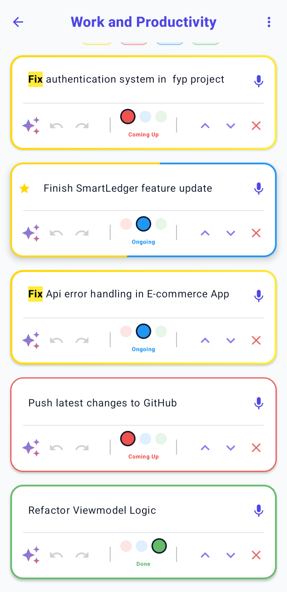
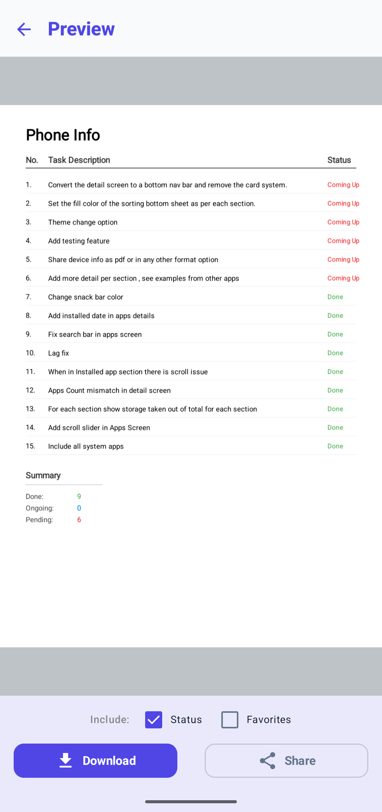
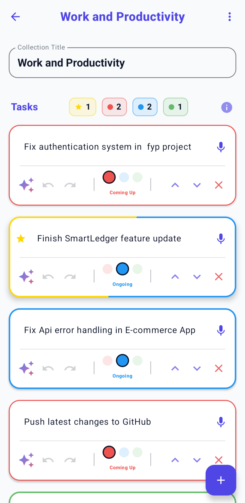
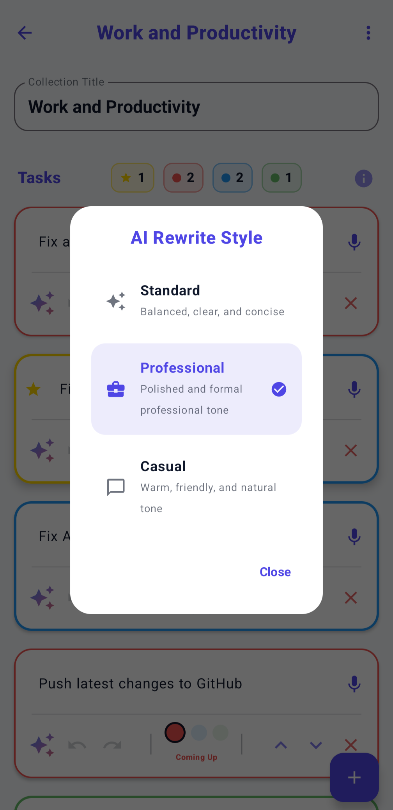

# TodoApp

## 📝 Description
TodoApp is a modern, feature-rich task management application designed to boost productivity. It goes beyond simple task lists by seamlessly integrating AI to refine and rewrite your tasks, voice input for hands-free data entry, and robust cloud sync to keep your projects updated across all your devices.

## ✨ Features
* **Cloud Sync & Authentication:** Seamlessly syncs your tasks and collections across multiple devices in real-time using Firebase. Includes offline support, robust conflict resolution, and seamless account linking via Google Sign-In.
* **Voice-to-Text Entry:** Integrated speech recognition allows you to quickly add or append text to tasks hands-free using your device's microphone.
* **AI-Powered Task Rewriting:** Utilizes the Groq API (running the `llama-3.3-70b-versatile` model) to instantly rewrite task descriptions. Users can choose between Standard, Professional, and Casual styles to match the context of their work.
* **Dynamic Search with Highlights:** Instantly filter collections and tasks from the dashboard. The application dynamically highlights matching search queries directly within the text for rapid navigation and context discovery.
* **Organized Collections:** Group tasks into overarching projects or collections. Pin high-priority collections to the top of your workspace for immediate access.
* **Visual Progress Tracking:** Get a quick overview of your productivity with multi-color progress bars that dynamically reflect the ratio of completed tasks, including specialized indicators for "Favorited" tasks.
* **Robust Undo/Redo System:** Fearlessly edit tasks with a comprehensive, built-in undo and redo stack, ensuring accidental deletions or changes are easily reverted.
* **PDF Preview & Export:** Preview beautifully formatted PDF documents of your task collections before seamlessly exporting them for sharing or offline tracking. Customizable settings allow you to include or exclude summaries, favorites, and task statuses.
* **Data Backup & Restore:** Safely export and backup your entire workspace (including app settings and task data) locally or securely via Google Drive integration. Import your `.zip` backups at any time to restore your state.
* **Interactive UI/UX:** Built entirely with Jetpack Compose, featuring smooth swipe-to-dismiss actions, haptic feedback, spring-physics animations, and an intuitive, modern aesthetic.

## 🛠 Tech Stack
* **Language:** Kotlin
* **UI Toolkit:** Jetpack Compose
* **Architecture:** MVVM (Model-View-ViewModel)
* **Local Database:** Room Database
* **Cloud & Auth:** Firebase Firestore, Firebase Authentication, Android Credential Manager
* **Background Processing:** WorkManager (for robust offline data syncing)
* **Networking:** Retrofit (for Groq API integration)
* **Concurrency:** Kotlin Coroutines & Flow
* **Serialization:** Gson

## 🏛 Architecture
This project follows the **MVVM (Model-View-ViewModel)** architectural pattern to ensure a clean separation of concerns and a highly testable, maintainable codebase:
* **Model:** Room Database acts as the fast local source of truth (`TodoGroupEntity`), while `SyncManager` coordinates with Firebase Firestore for real-time remote syncing.
* **ViewModel:** `TodoViewModel` manages the UI state, handles business logic (like the custom Undo/Redo stack), and acts as the bridge between the UI and the local repository using Kotlin Flows.
* **View:** Jetpack Compose screens (`DashboardScreen`, `AddTodoScreen`) observe the ViewModel's state flows and reactively render the UI.
* **Network & Background Layer:** A decoupled `AiHelper` object leverages Retrofit to handle asynchronous API calls to the Groq API. `SyncWorker` and `SyncManager` use WorkManager to guarantee eventual consistency for offline edits.

## 📸 Screenshots

|                   Workspace Dashboard                   | Task Editing & Highlights | PDF Preview & Export |
|:-------------------------------------------------------:| :---: | :---: |
|  |  |  |
| *View collections, pin favorites, and track progress.*  | *Search text dynamically highlights inside tasks.* | *Preview beautifully formatted PDF exports.* |

| Task Screen |                          AI Rewrite Styling                           |
| :---: |:---------------------------------------------------------------------:|
|  |  |
| *Manage tasks with undo/redo, status tracking, and AI.* |          *Choose professional or casual AI rewrite styles.*           |

## 🚀 Installation

1. **Clone the repository:**
   ```bash
   git clone https://github.com/mudasirunar/TodoApp.git
   ```
2. **Open in Android Studio:**
   * Open Android Studio.
   * Select **File > Open** and navigate to the cloned `TodoApp` directory.
3. **Configure API Keys & Firebase:**
   * This app requires a Groq API key for the AI rewrite features. Open the `local.properties` file in the root of your project (create it if it doesn't exist) and add your API key:
     ```properties
     GROQ_API_KEY="your_actual_api_key_here"
     ```
   * Set up a Firebase project, enable Firestore and Authentication (Google Sign-In and Anonymous authentication), and download your `google-services.json` file. Place it in the `app/` directory.
4. **Run the app:**
   * Connect an Android device or start an emulator.
   * Click the **Run** button (green play icon) in Android Studio.

## 🔮 Future Improvements
* **Collaborative Workspaces:** Add features to share specific task collections with other users for real-time collaboration.
* **Advanced AI Features:** Expand the AI capabilities to auto-generate subtasks based on a broad project title.